# What is Lake House?
An Open Data Management Architecture which unifies Data warehousing and Advanced Analytics.
* Combines best part of Data warehouse and Data Lake.
* Phenomenal Data Management and Business Intelligence.
* Data Engineers to build the pipeline of Data Munging, Data Transformation, Data Processing for down stream application to use.  
* Data Scientist at the down stream side build AI and ML part of analytics while Data Analyst build BI and Analyst processing.
* Integration with other external system let the processed data be consumed else where.
* Support of variety of data formats.
* A unified system to support all these features under one roof.


# Azure Delta Lake
An open-source project that allows building `Lake House Architecture` on the top of 
`Data Lakes` like HDFS, S3, ADLS, GCS.
Using `compute engines` like Spark, Flink, PrestoDB, Trino.
Supporting variety of `language APIs` like Java, Python, Scala, SQL, Rust, Ruby, NodeJS.
* At the heart of the Delta Lake, data is represented as a Table 
* Tables in Delta Lake supports ACID properties, constraints, joins and complex queries.
* They can accommodate stream data on the fly and operations on them may also change results with fresh data pumped in.

## 1. Delta Lake Architecture
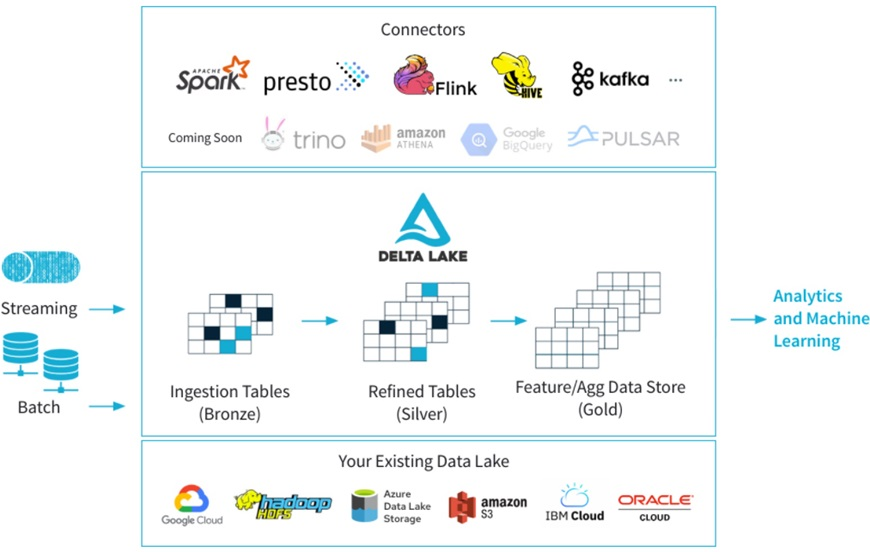

## 2. Requirements and basics
* Azure Databricks service with Premium plan
* A storage account service loaded with streaming data to ingest into Batch and Stream Pipeline.

## 3. Making development environment ready.
### 1) Home Page of Azure Databricks
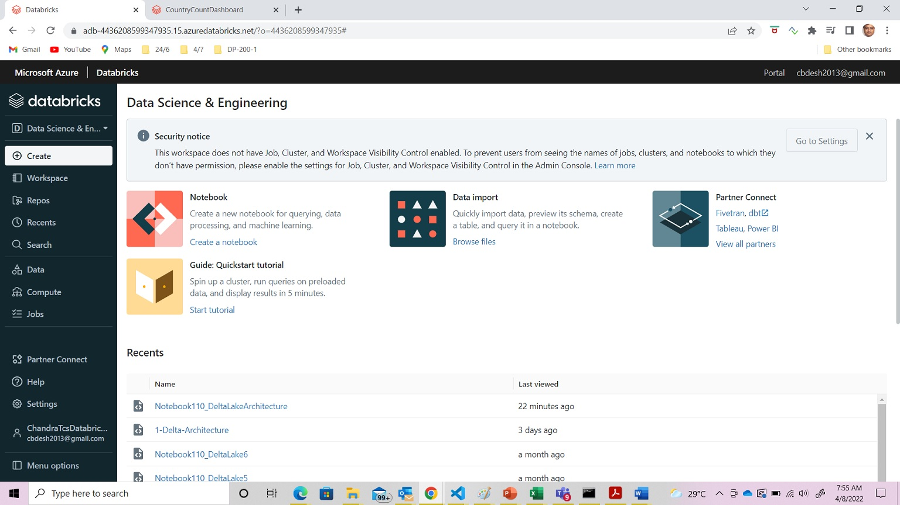

### 2) Set the side bar mode
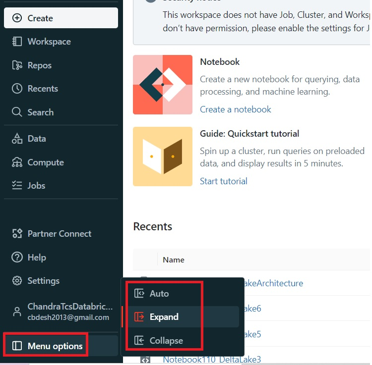

### 3) Select Persona and create Notebook
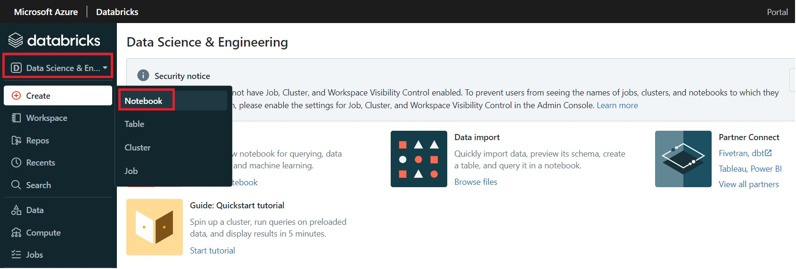

### 4) Create an All Purpose Cluster as Compute to run Python/PySpark commands.
    - Cluster Node: Select Single Node.
    - Node Type: Select cheaper but sufficient machine.

    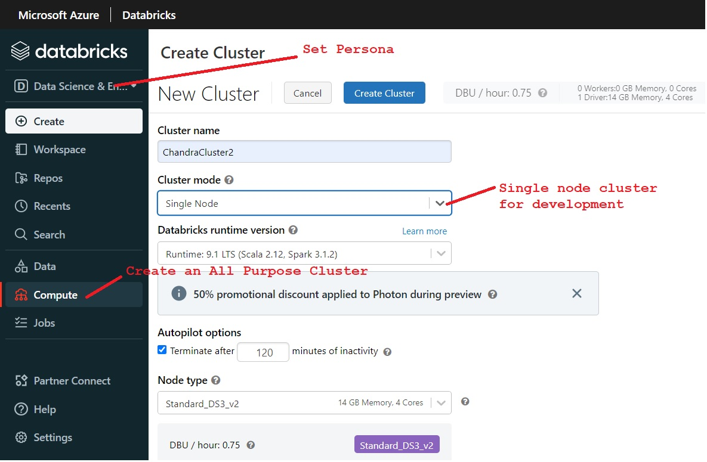

### 5) Create a Python Notebook
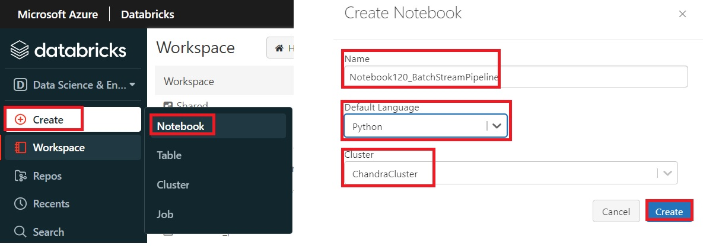

### 6) Observe the Notebook Layout


## Writing script
### 7) Configure and set up relevant Delta Lake paths

These paths will serve as the file locations for our Delta Lake tables.

- Each streaming write has its own checkpoint directory.
- You cannot write out new Delta files within a repository that contains Delta files. Note that our hierarchy here isolates each Delta table into its own directory.
```python
username = "cbdesh2013@gmail.com"
userhome = "dbfs:/user/" + username

# Set the user's name and home directory
spark.conf.set("com.databricks.training.username", username)
spark.conf.set("com.databricks.training.userhome", userhome)

# Setup paths of checkpoints for layers
activityPath = userhome + "/activity"

activityBronzePath = activityPath + "/Bronze"
activityBronzeCheckpoint = activityBronzePath + "/checkpoint"

activitySilverPath = activityPath + "/Silver"
activitySilverCheckpoint = activitySilverPath + "/checkpoint"

activityGoldPath = activityPath + "/Gold"
groupedCountPath = activityGoldPath + "/groupedCount"
groupedCountCheckpoint = groupedCountPath + "/checkpoint"
```
### 8) Reset pipeline
```python
dbutils.fs.rm(activityPath, True)
```

### 9) Configure Data Source from where to ingest data.
```python
path = "wasbs://container@store.blob.core.windows.net/"
spark.conf.set("fs.azure.account.key.store.blob.core.windows.net", "--AccessKey--")
```

### 10) Define schema for the data set
```python
from pyspark.sql.types import StructField, StructType, LongType, StringType, DoubleType

schema = StructType([
    StructField("Arrival_Time",LongType()),
    StructField("Creation_Time",LongType()),
    StructField("Device",StringType()),
    StructField("Index",LongType()),
    StructField("Model",StringType()),
    StructField("User",StringType()),
    StructField("geolocation",StructType([
    StructField("city",StringType()),
    StructField("country",StringType())
    ])),
    StructField("gt",StringType()),
    StructField("id",LongType()),
    StructField("x",DoubleType()),
    StructField("y",DoubleType()),
    StructField("z",DoubleType())
])
```
### 11) Load the stream data and create dynamic data frame.
- Format is Json
- When schema is enforced, inference on schema is disabled.
- The option 'maxFilesPerTrigger' controls the amount of data which is consumed with each load from disk.  If omited it consumes all new data on disk since the last time the stream has processed.
```python
rawEventsDF = (spark
    .readStream
    .format("json")
    .schema(schema)
    .option("maxFilesPerTrigger", 1)
    .load(path+"deltadata.json"))
```
### 12) The Delta Lake Architecture
- The Bronze layer represents raw data.  It accomodates the data which directly comes from the data source before any kind of transformation.
- The Silver layer represents transformed data. On cleaning, filtering, augmenting, joining the raw data, it lays Silver tables.
- The Gold layer represents business level aggregation. The data in this layer is now ready for querying for visulization and reporting.
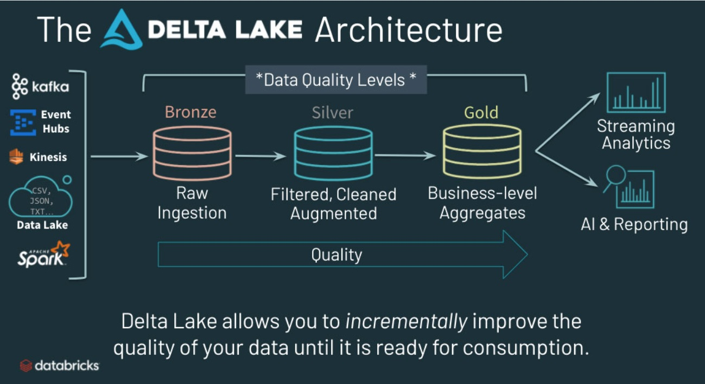

### 13) Write the data from dynamic data frame to bronze check point in `delta` format.
#### Output Modes
Notice, besides the `obvious` parameters, specify `outputMode`, which can take on these values
* `append`: Add only new records to output sink
* `complete`: Rewrite full output - applicable to aggregations operations
* `update`: At present, the `update` mode is not supported for streaming Delta jobs.

#### Important points to note.
* The `checkpointLocation` is a structured streaming feature which stores the current state of your streaming job. Should your streaming job stops for some reason and you restart it, it will continue from where it left off.
* If you do not have a checkpoint directory, when the streaming job stops, you lose all state around your streaming job and upon restart, you start from scratch.
```python
# Its a completely raw data being represented in Bronze Table.
(rawEventsDF
    .writeStream
    .format("delta")
    .option("checkpointLocation", activityBronzeCheckpoint)
    .outputMode("append") # Keep appending the stream data into the dynamic data frame.
    .start(activityBronzePath))
```
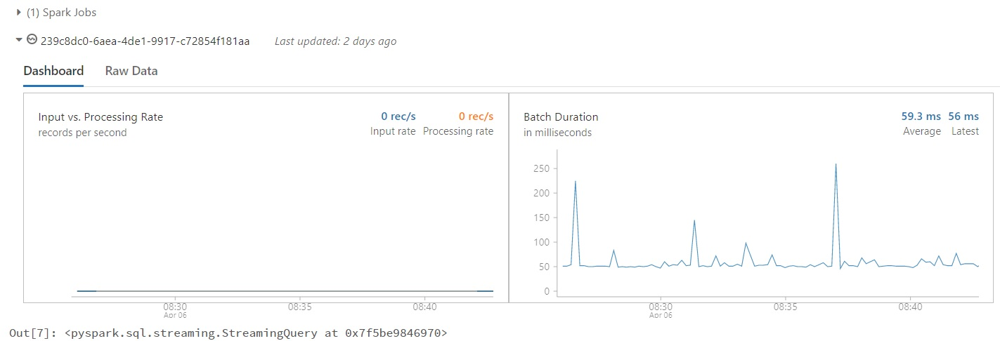

### 14) Load dimension data and create a static data frame
- Creating a static data frame from the parquet file.  The file format can be any valid one supported by Spark.
```python
# A static data frame creating a kind of lookup table representing Countries uniquely identified using Country ID.
from pyspark.sql.functions import col

geoForLookupDF = (spark
  .read
  .format("parquet")
  .load(path + "GeoLookup.parquet")
  .select(col("EnglishShortName").alias("country"), col("alpha3Code").alias("countryCode3")))
```
### 15) Create Silver tables i.e. query tables or tables duely enriched using tranformations.

* Load earlier created bronze table.  Join it with dimention data frame to get details of country using common country code column.
* We do not need to specify a schema when loading Delta files: it is inferred from the metadata!
* The bronze table contains nested fields, as well as time data that has been encoded in non-standard unix time (Arrival_Time is encoded as milliseconds from epoch, while Creation_Time records nanoseconds between record creation and receipt).

```python
# The perform transformations on the raw data.
from pyspark.sql.functions import from_unixtime

parsedEventsDF = (spark.readStream
    .format("delta")
    .load(activityBronzePath)
    .select(from_unixtime(col("Arrival_Time")/1000).alias("Arrival_Time").cast("timestamp"),
            (col("Creation_Time")/1E9).alias("Creation_Time").cast("timestamp"),
            col("Device"),
            col("Index"),
            col("Model"),
            col("User"),
            col("gt"),
            col("x"),
            col("y"),
            col("z"),
            col("geolocation.country").alias("country"),
            col("geolocation.city").alias("city"))
    .join(geoForLookupDF, ["country"], "left"))
```
### 16) Persist the transformed data into `Silver Layer
```python
# Persist the transformed data into Silver layer.
(parsedEventsDF
    .writeStream
    .format("delta")
    .option("checkpointLocation", activitySilverCheckpoint)
    .outputMode("append")
    .start(activitySilverPath))
```
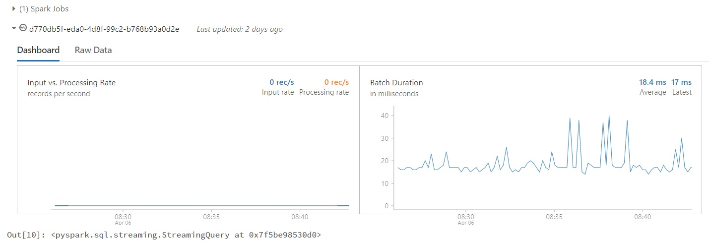

#### Observe the contents of Silver Directory
```python
dbutils.fs.ls(activitySilverPath)
```
### 17) List all active streams
There are two writes working as of now so are two active streams. If streaming data frames are displayed using display(), note there will be 4 active streams as the display() creates active stream to transfer data from layer to memory.

There are two active streams as of now.  One for Bronze and another for Silver layer.

```python
for s in spark.streams.active:
  print(s.id)
```
But with the use of display() two more streams are created as it will have to stream delta data to memory.

```python
display(rawEventsDF)
display(parsedEventsDF)
for s in spark.streams.active:
  print(s.id)
```
    Output: 
        
        d770db5f-eda0-4d8f-99c2-b768b93a0d2e
        239c8dc0-6aea-4de1-9917-c72854f181aa
        68748ccd-7f44-4c57-bd37-c47dec5f3bf6
        09f06461-4c12-4d59-8402-c025adff43d8

### 18) Apply aggregation to create gold tables.
* The data consists of a total counts of all event, grouped by `hour`, `gt`, and `countryCode3`.
* Performing this aggregation allows us to reduce the total number of rows in our table from hundreds of thousands (or millions, once we've loaded our batch data) to dozens.
* we read a stream of data from `activitySilverPath` and write another stream to `activityGoldPath/groupedCount`.
* **V.IMP**: When using complete output mode, we rewrite the entire state of our table each time our logic runs. While this is ideal for calculating aggregates, we cannot read a stream from this directory, as Structured Streaming assumes data is only being appended in the upstream logic.
    ```python
    # Apply aggregation operations.
    from pyspark.sql.functions import window, hour
    
    (spark.readStream
      .format("delta")
      .load(activitySilverPath)
      .groupBy(window("Arrival_Time", "60 minute"),"gt", "countryCode3")
      .count()
      .withColumn("hour",hour(col("window.start")))
      .drop("window")
      .writeStream
      .format("delta")
      .option("checkpointLocation", groupedCountCheckpoint)
      .outputMode("complete")
      .start(groupedCountPath))
    ```
Observe the contents of groupCountPath directory
    ```python
    dbutils.fs.ls(groupedCountPath)
    ```
### 19) Create a table of Gold/aggregated data.
- The table 'grouped_count' created here becomes visible in Azure Databricks SQL to create a dashboard.

    ```python
    spark.sql("""
      DROP TABLE IF EXISTS grouped_count
    """)
    spark.sql("""
      CREATE TABLE grouped_count
      USING DELTA
      LOCATION '{}'
    """.format(groupedCountPath))
    ``` 
### 20) Query a table and observe its visualization.
* The gold Delta table we have just registered will perform a static read of the current state of the data each time we run the following query.
* We will need to re-run this query each time we wish to update the data. Run the below query now, and then after your batch has finished processing.
* The state reflected in a query on a registered Delta table will always reflect the most recent valid state of the files.

    ```sql
    SELECT * FROM grouped_count
    ```
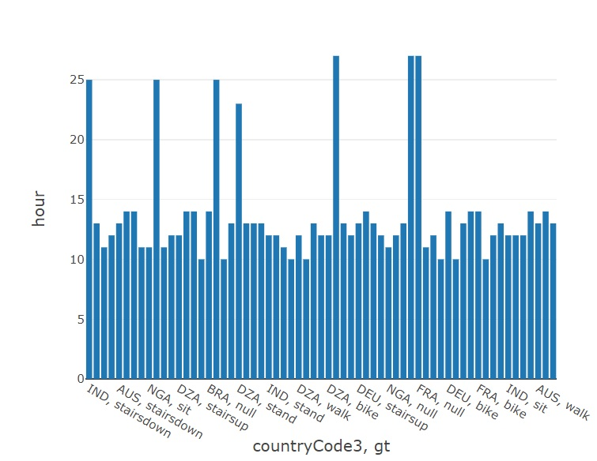

### 21) Create a Temp View/Materialized View.
- We can not define a streaming plot or create a Temp View on Gold Layer as its output mode is 'Complete' and not 'Append'.
- Here, we create a temp view on Silver Layer.
    ```python
    (spark.readStream
      .format("delta")
      .load(activitySilverPath)
      .createOrReplaceTempView("query_table")
    )
    ```
### 22) Query temp view
```sql
SELECT gt, HOUR(Arrival_Time) hour, COUNT(*) total_events
FROM query_table
GROUP BY gt, HOUR(Arrival_Time)
ORDER BY hour
```
* Select 'Bar' plot
* Series Grouping `gt`
* Values `total_events`
* Grouped
* Aggregation `sum`

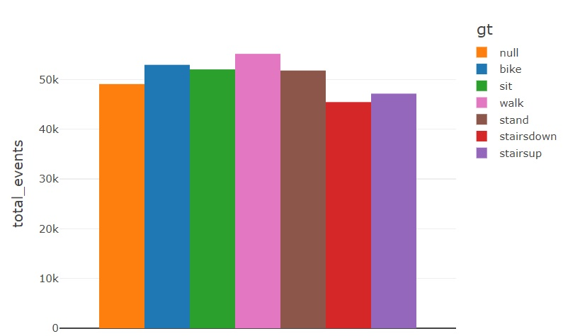

### 23) Wrapping up
- Stop all streams
```python
for s in spark.streams.active:
    s.stop()
```
# ------------ And thats all --------------------
