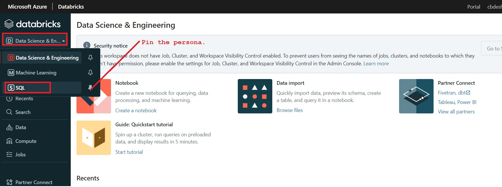
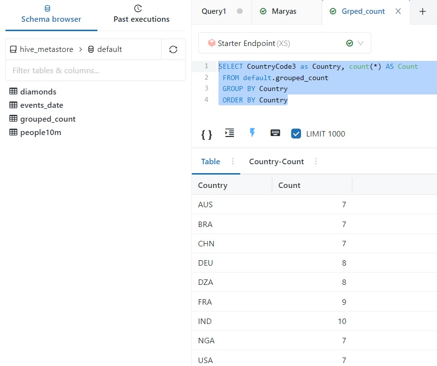

# Azure Databricks SQL-I
The `Databricks SQL` provides an intuitive environment for running *ad-hoc queries* and creating *dashboards* on data stored in your data lake.
## Features
* **Platform for Ad-hoc Queries**: For quickly executing Ad-Hoc Queries on Data Lake.
* **Visualization Types**: User can explore results in differernt perspective by using multiple visualizations.
* **Auto-Scalable Compute**: As a highly scalable compute offers fully managed SQL endpoints which can scale as per complexity of query and number of concurrent users.
* **Dashboard**: Draw insights from queries by combining visuals and text.
* **Alerts**: Alerts notify you when a field returned by a query meets a threshold.
* **Enterprise Sequrity**: Provides enterprise-grade Azure security, including Azure Active Directory integration, role-based controls, and SLAs that protect your data and your business.

## Requirements and basics
* Azure Databricks service with Premium plan
* Every user in the workspace must have Databricks SQL access Entitlement.
* The earlier lab `Demo010_DeltaLake` must be completed so that the table `grouped_count` must be existing.

### 1) Select Persona


### 2) After successful login, the page looks like...


### 3) Create an SQL Endpoint


### 4) Configure an SQL Endpoint

Also ensure that the End point has been started.

### 5) You can view the list of all SQL Endpoints.
Side bar -> SQL Endpoints


### 6) Open an SQL Editor
Side bar -> SQL Editor

Observe, in the list of default hive-metastore, the table `grouped-count` is appearing.

### 7) Create a new query pad
Side bar -> Create -> Query

In this step `creating a new query pad` is essential as if this query is placed along with other queries, it creates problem in visualization and creating dashboard.

### 8) Query a table created in earlier exercise.
```sql
SELECT CountryCode3 as Country, count(*) AS Count
    FROM default.grouped_count
    GROUP BY Country
    ORDER BY Country
```


Observe here, the `table` view is by default created.

### 9) Add new visuals and configure it.

General Configuration...


Configuration for X axis: Give the label name

Configuration for Y axis: Give the label name

Configuration for colours: Select the colour soothing to eyes.

Click on Save


So now, we have two visuals...

- Table
- Visual_Country_Count

### 10) Create a Dashboard for these two visuals.


Name it as `DashboardCountryCount`


### 11) Add Visuals on the dashboard


Add both visuals to dashboard.  Now it looks like as...
    
