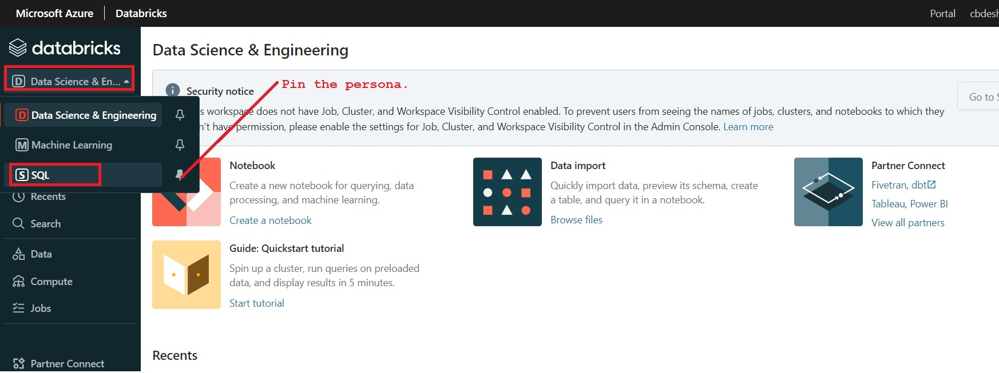

# Azure Databricks SQL-II

## Requirements and basics
* Azure Databricks service with Premium plan
* Every user in the workspace must have Databricks SQL access Entitlement.

### 1) Select Persona


### 2) Create an SQL Endpoint


### 3) Configure an SQL Endpoint


### 4) You can view the list of all SQL Endpoints.
Side bar -> SQL Endpoints


### 5) Open an SQL Editor
Side bar -> SQL Editor


### 6) Create a sample table from a sample delta file
Run the following query. 
```sql
CREATE TABLE default.people10m OPTIONS (PATH 'dbfs:/databricks-datasets/learning-spark-v2/people/people-10m.delta')
```
The table will be created from sample file.


### 7) Query a created table.


### 8) View Schema


### 9) Create a new Query book
Side bar -> Create -> Query

In this step `creating a new query pad` is essential as if this query is placed along with other queries, it creates problem in visualization and creating dashboard.

### 10) Query the people table with group by and order by. To query number of woman named 'Mary'.
```sql
SELECT year(birthDate) as birthYear, count(*) AS total
    FROM default.people10m
    WHERE firstName = 'Mary' AND gender = 'F'
    GROUP BY birthYear
    ORDER BY birthYear
```
The check box of 'Limit' is selected by default. It defines the maximum limit.  If to change this value, uncheck the box and add the 'LIMIT' clause within query.


### 11) Create visualization

Click on +Add Visualiation.

    Fill the following information...
    - Chart Name: Bar_BirthYear-Total
    - Visualization Type: Bar
    General:
    - X-Column: BirthYear
    - Y-Colum: Total
    X-Axis:
    - Name: Birth Year
    Y-Axis:
    - Name: Total
    Colour: Of your choice.


  

- Save the visualization.
- Save the query with name 'Maryas'.
- The query associated with visualization must be existing in its own and separate query file.

### 12) Create a Dashboard
- Expand +Create -> Dashboard.  
- Name it as 'People'.
- Set the End Point and click on 'Add Visualization'.


### 13) Observe the Dashboard
