# Azure Databricks SQL: Creating dashboard from Samples

## Requirements and basics
* Azure Databricks service with Premium plan
* Every user in the workspace must have Databricks SQL access Entitlement.

### 1) Select Persona
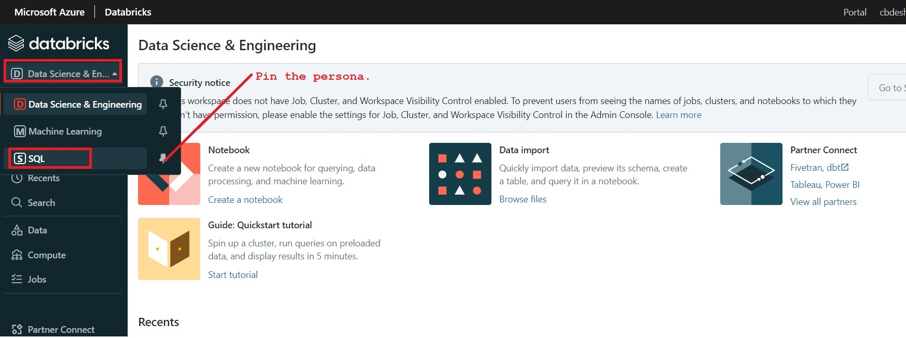

### 2) Create an SQL Endpoint
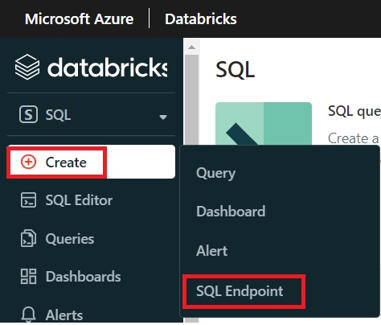

### 3) Configure an SQL Endpoint
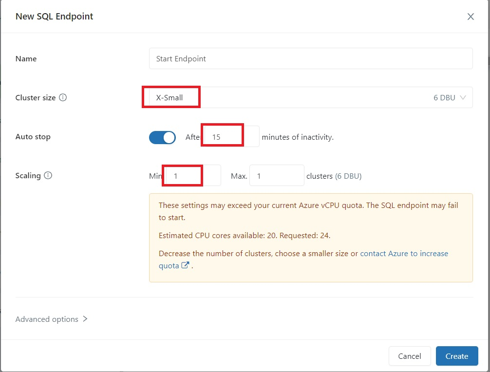

### 4) You can view the list of all SQL Endpoints.
Side bar -> SQL Endpoints
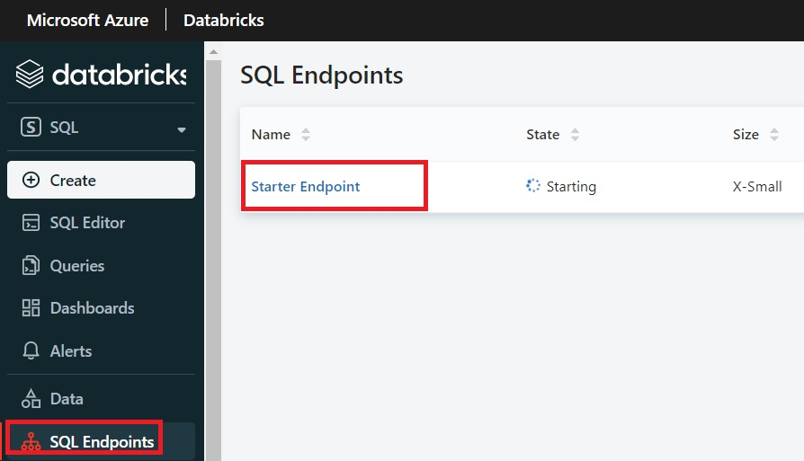

### 5) Location from where you can get samples
SQL Persona -> Persona Home Page
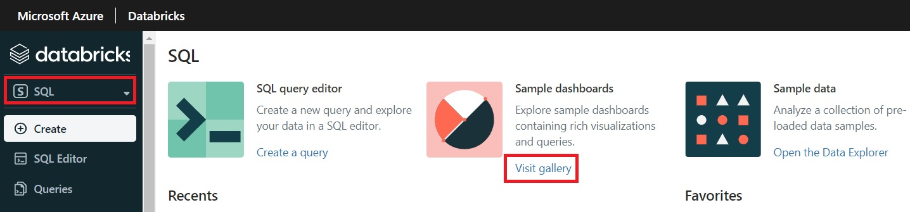

Another place from where you may get Samples.
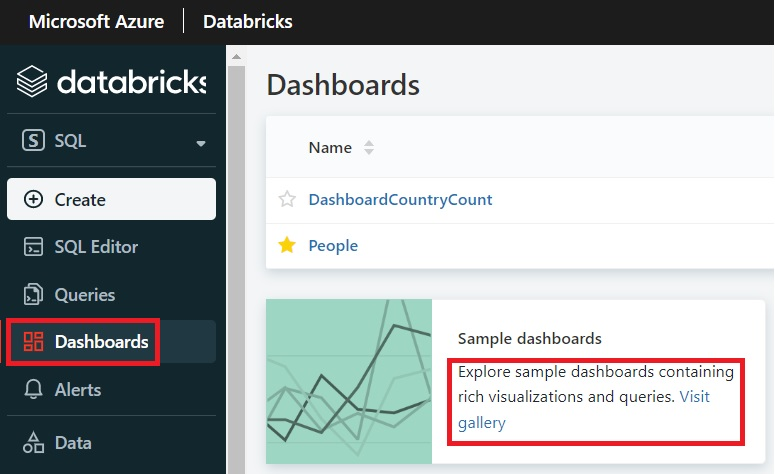

There are two samples as of now...
- NYC Taxi Trip Analysis
- Retail revenue and supply chain (It may not work)

### 6) Select and import sample
Side bar -> SQL Editor
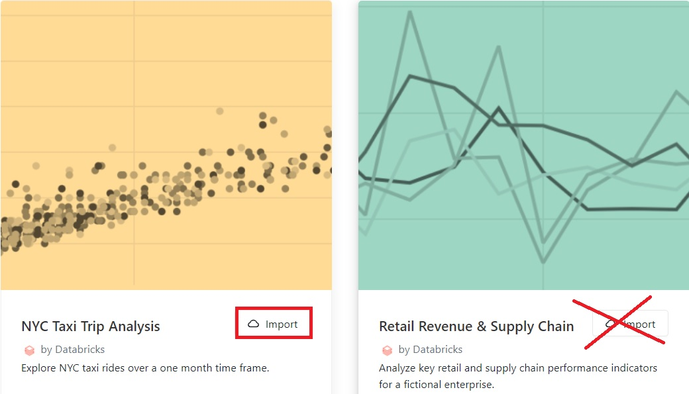

Click on `Import`

### 7) The dashboard is imported and looks like as...
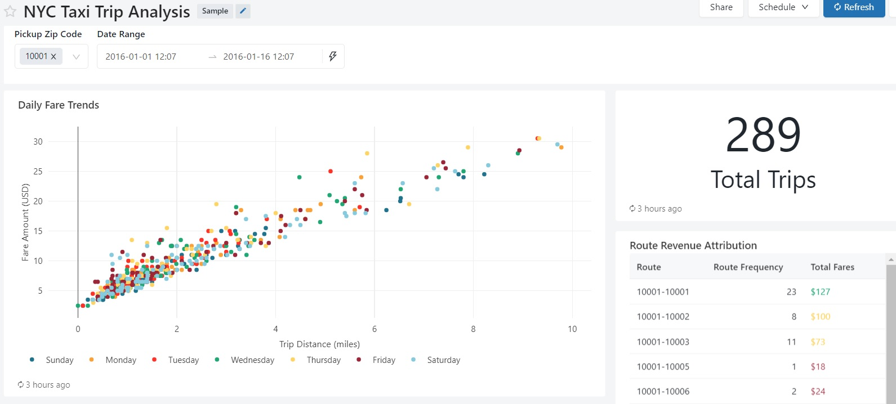

### 8) Explore visualization query
Each visualization in a dashboard is the result of a query. In the imported dashboard, hover over a visual, then click the context menu, which looks like three vertical dots. Click View Query.
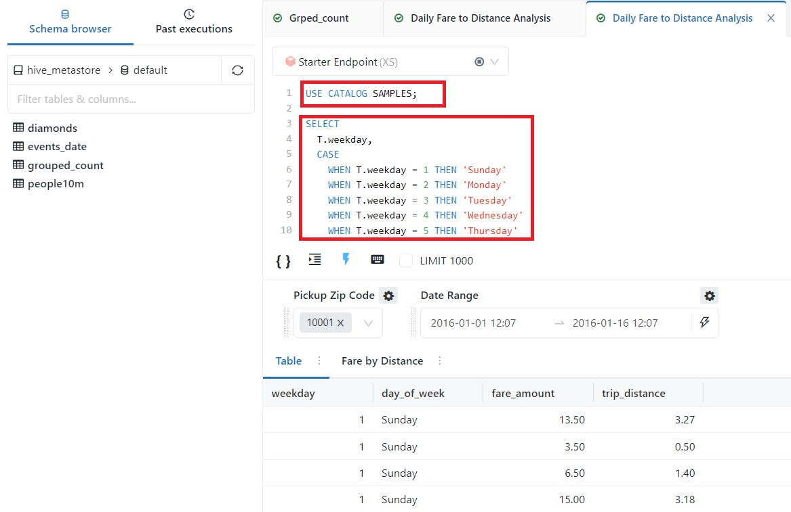
The sample dashboards use data in the SAMPLES catalog, which is separate from data within your workspace. The SAMPLES catalog is available to every workspace, but is read-only.

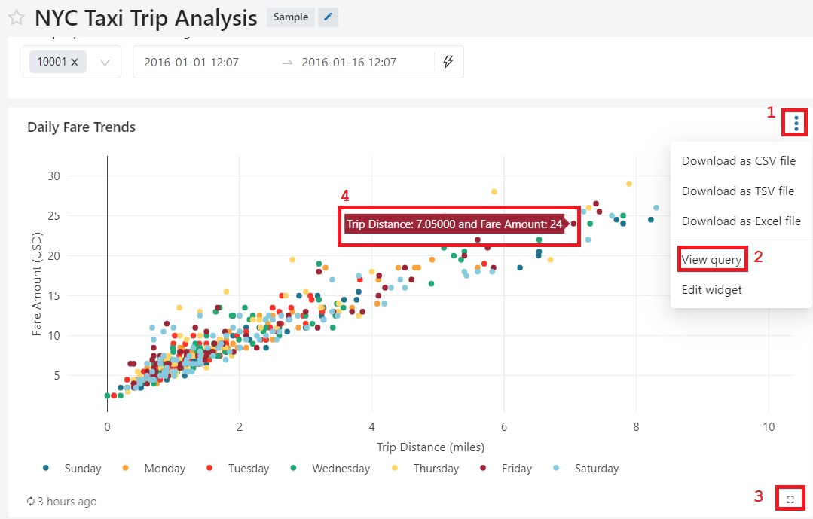
1. A context menu.
2. From here, you can view queries
3. Expand the visual.
4. Hover over visual to see details.

### 9) Share a dashboard.
- Add user
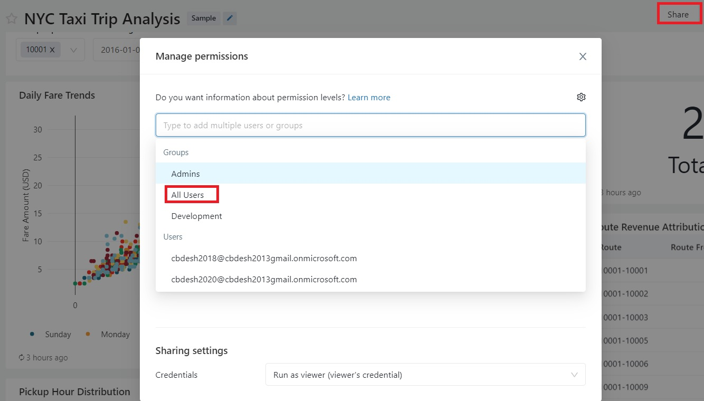

- Set permission
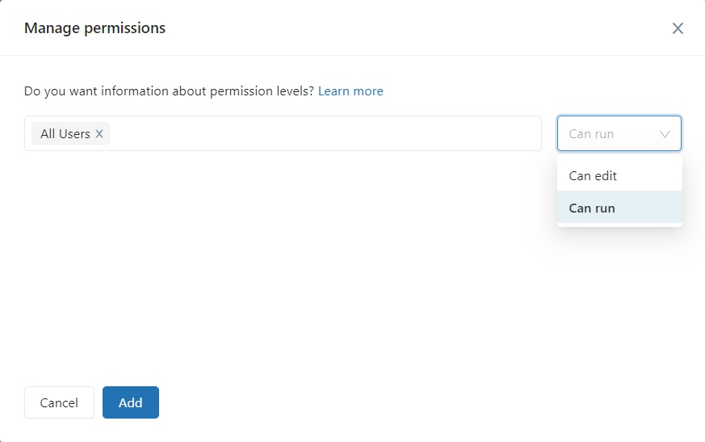

- Sharing Settings
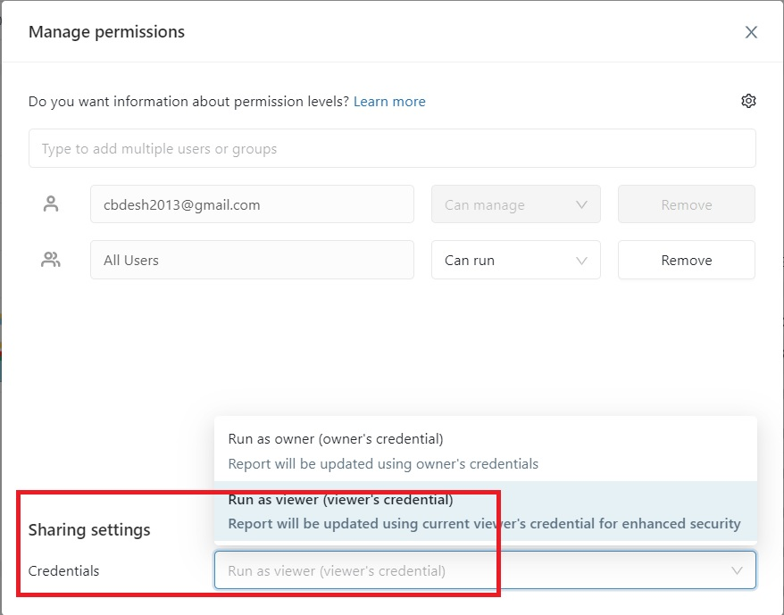

### 10) Schedule refresh of dashboard.
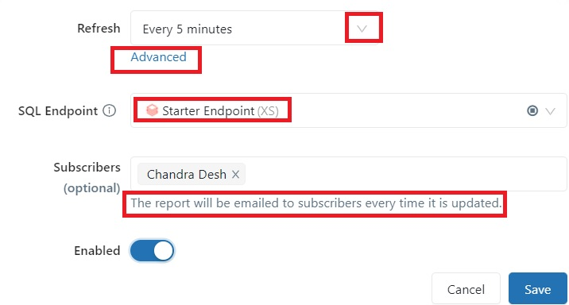

- You can schedule the dashboard to automatically refresh at an interval.
- At the top of the page, click Schedule.
- If the dashboard already has a schedule, you see Scheduled instead of Schedule.
- Select an interval, such as Every 1 hour.
- You can click Advanced to create a more complex interval, such as every 5 years.
- Select a SQL endpoint. A SQL endpoint is a compute resource that is specific to Databricks SQL. The SQL endpoint runs the dashboard’s queries and generates the visualizations when the dashboard is refreshed. Select Starter endpoint, which is created automatically on each workspace.
- Admin users can create, configure, and delete SQL endpoints.
- Optionally, subscribe workspace users or alert destinations to receive an email version of the dashboard when it is automatically refreshed.
- Admin users can create, configure, and delete alert destinations. The email addresses of workspace users are automatically added as alert destinations.
- Click Save.
- The dashboard will be refreshed according to the schedule.
- To stop automatically refreshing a dashboard:
    - Click Scheduled.
    - Set Refresh to Never.
    - Click Save.

